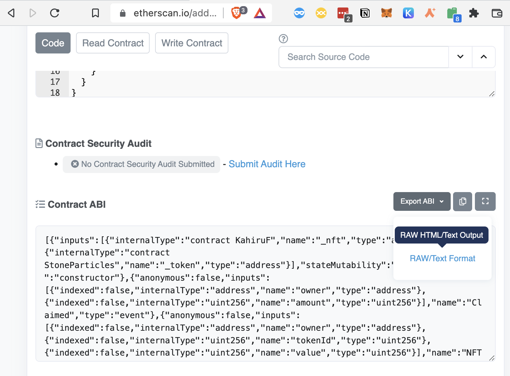
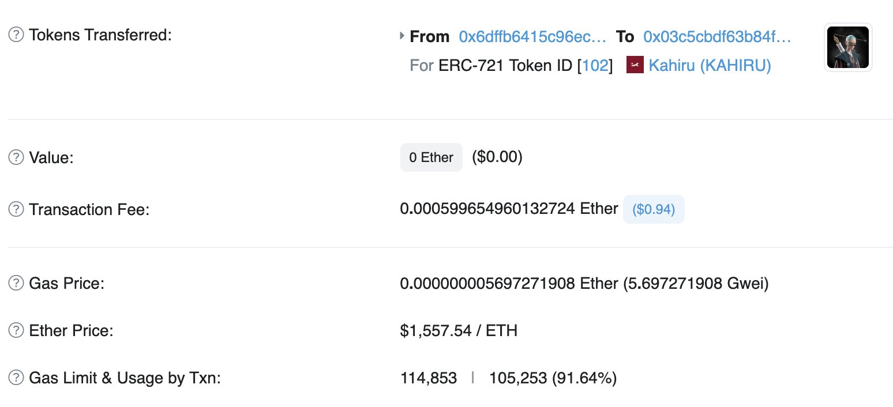

# how to build your bundle

> All code examples in `src/engine/kahiru.ts`

1. Create a class that inherits from base in `src/engine`, and you need to implement `description()` and `getSponsoredTransactions()`. The class name should not same as the other class in the engine folder.

```typescript
import { TransactionRequest } from "@ethersproject/abstract-provider";
import { Base } from "./Base";

export class Kahiru extends Base {
  async description(): Promise<string> {
    throw new Error("Method not implemented.");
  }

  async getSponsoredTransactions(): Promise<TransactionRequest[]> {
    throw new Error("Method not implemented.");
  }
}
```

2. Find the contract address and ABI you want to send in etherscan, and storage variables in the file. For example, the Kahiru NFTStaking contract link is [https://etherscan.io/address/0x6DffB6415c96EC393Bf018fB824934d7b5B637a0#code](https://etherscan.io/address/0x6DffB6415c96EC393Bf018fB824934d7b5B637a0#code). You can find ABI in the web page. You just need to copy the function you use, but copy/paste all is OK.


For Kahiru, I want to pay gas unstake NFT and transfer to the recipient. It's two contracts, so find addresses and ABIs and save them in the file. The ABI should be an array.

```typescript
import { TransactionRequest } from "@ethersproject/abstract-provider";
import { Base } from "./Base";

const KahiruStakingContract = '0x6DffB6415c96EC393Bf018fB824934d7b5B637a0' // stakeNFT
const KahiruNFTContract = '0x0326b0688d9869a19388312Df6805d1D72AaB7bC' // NFT

const STAKING_ABI = [{ "inputs": [{ "internalType": "uint256[]", "name": "tokenIds", "type": "uint256[]" }], "name": "unstake", "outputs": [], "stateMutability": "nonpayable", "type": "function" }]
const NFT_ABI = [
  { "inputs": [{ "internalType": "address", "name": "from", "type": "address" }, { "internalType": "address", "name": "to", "type": "address" }, { "internalType": "uint256", "name": "tokenId", "type": "uint256" }], "name": "transferFrom", "outputs": [], "stateMutability": "nonpayable", "type": "function" }
]

export class Kahiru extends Base {
  async description(): Promise<string> {
    throw new Error("Method not implemented.");
  }

  async getSponsoredTransactions(): Promise<TransactionRequest[]> {
    throw new Error("Method not implemented.");
  }
}
```

3. Create the constructor, then create address(string) and contract(ethers.Contract) fields, pass the provider, sender, and recipient in, then reference to fields.

```typescript
import { TransactionRequest } from "@ethersproject/abstract-provider";
import { Contract, providers } from "ethers";
import { isAddress } from "ethers/lib/utils";
import { Base } from "./Base";

const KahiruStakingContract = '0x6DffB6415c96EC393Bf018fB824934d7b5B637a0' // stakeNFT
const KahiruNFTContract = '0x0326b0688d9869a19388312Df6805d1D72AaB7bC' // NFT

const STAKING_ABI = [{ "inputs": [{ "internalType": "uint256[]", "name": "tokenIds", "type": "uint256[]" }], "name": "unstake", "outputs": [], "stateMutability": "nonpayable", "type": "function" }]
const NFT_ABI = [
  { "inputs": [{ "internalType": "address", "name": "from", "type": "address" }, { "internalType": "address", "name": "to", "type": "address" }, { "internalType": "uint256", "name": "tokenId", "type": "uint256" }], "name": "transferFrom", "outputs": [], "stateMutability": "nonpayable", "type": "function" }
]

export class Kahiru extends Base {
  private _sender: string;
  private _recipient: string
  private _KahiruStakingContract: Contract;
  private _KahiruNFTContract: Contract;

  constructor(provider: providers.JsonRpcProvider, sender: string, recipient: string) {
    super();
    if (!isAddress(recipient)) throw new Error("Bad recipient Address")
    if (!isAddress(sender)) throw new Error("Bad sender Address")
    this._sender = sender;
    this._recipient = recipient;
    this._KahiruStakingContract = new Contract(KahiruStakingContract, STAKING_ABI, provider);
    this._KahiruNFTContract = new Contract(KahiruNFTContract, NFT_ABI, provider);
  }

  async description(): Promise<string> {
    throw new Error("Method not implemented.");
  }

  async getSponsoredTransactions(): Promise<TransactionRequest[]> {
    throw new Error("Method not implemented.");
  }
}
```

4. implement description() and getSponsoredTransactions()

description() will show a message after launch, I suggest printing out the contract address, this._sender, and this._recipient.
In getSponsoredTransactions(), you need to create multiple `TransactionRequest` push into and `Array<TransactionRequest>` and return.

`TransactionRequest` should be like `{ ...await this._KahiruNFTContract.populateTransaction.transferFrom(this._sender, this._recipient, tokenId),gasLimit: 70000 }`, set gaslimit by hand because sometimes simulate gas will fail.

Gaslimit can be found in history transactions by other people.



Final code in [kahiru](../src/engine/kahiru.ts).

5. Add new engine in `src/index.ts`, then run code use `yarn start`

```typescript
import { Kahiru } from "./engine/kahiru";

// ....
async function main() {
  // ...
  const engine: Base = new Kahiru(provider, walletExecutor.address, RECIPIENT); 
  //...
}
```
